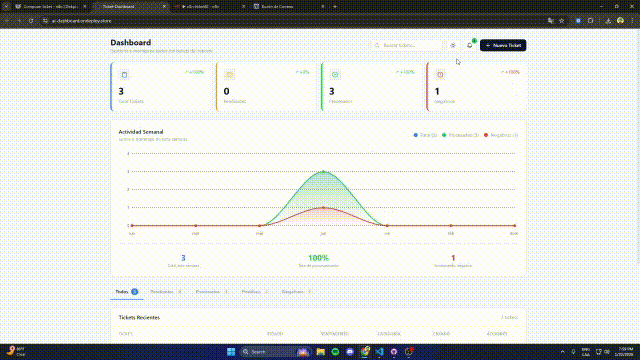

# Support Ticket AI


Sistema de gestión de tickets de soporte sistema capaz de recibir tickets de soporte, para categorizarlos y analizar su sentimiento procesandolos mediante agentes de IA, y visualizarlos en tiempo real en un dashboard.

## Produccion

- **Frontend:** [https://ai-dashboard.ondeploy.store/](https://ai-dashboard.ondeploy.store/)
- **API:** [https://python-api.ondeploy.store/docs](https://python-api.ondeploy.store/docs)



## Estructura

```
├── frontend/       # Dashboard React + Vite
├── python-api/     # API REST FastAPI
├── n8n-workflow/   # Workflows de automatización
└── supabase/       # Table & RLS policies
```

### Documentación

- [Frontend README](frontend/README.md) - Configuración y desarrollo del dashboard
- [Python API README](python-api/README.md) - Endpoints, configuración y despliegue de la API

## Prompt Engineering

La clasificación de tickets utiliza una estrategia de **Structured Output Prompting** con las siguientes técnicas:

### Técnicas aplicadas

1. **Role Prompting**: Se define un rol específico para el modelo como analista de tickets de soporte.
2. **Output Formatting**: Se fuerza respuesta exclusivamente en JSON válido con estructura predefinida.
3. **Few-shot Example**: Se incluye un ejemplo del formato esperado para guiar la respuesta.
4. **Constrained Generation**: Se limitan las opciones válidas a categorías y sentimientos predefinidos.
5. **Low Temperature (0.1)**: Configuración determinista para respuestas consistentes.

### Prompt utilizado

```
System: "Eres un asistente que analiza tickets de soporte al cliente.
         Responde ÚNICAMENTE con JSON válido."

User: "Analiza el siguiente ticket y responde con un JSON con dos campos:
       - "category": una de estas categorías: [lista predefinida]
       - "sentiment": uno de estos sentimientos: positivo, negativo, neutro

       Ticket: "{texto}"

       Responde SOLO con el JSON, ejemplo: {"category": "soporte técnico", "sentiment": "negativo"}"
```

### Validación y fallbacks

El sistema incluye parsing robusto con regex y valores por defecto (`"otros"`, `"neutro"`) para garantizar respuestas válidas ante cualquier output del LLM.
